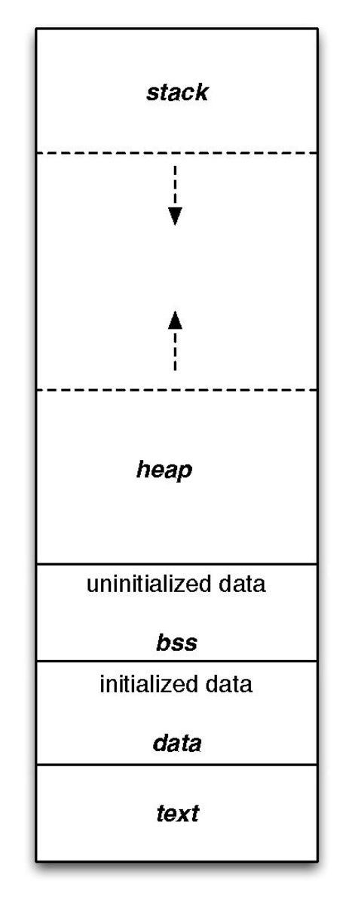
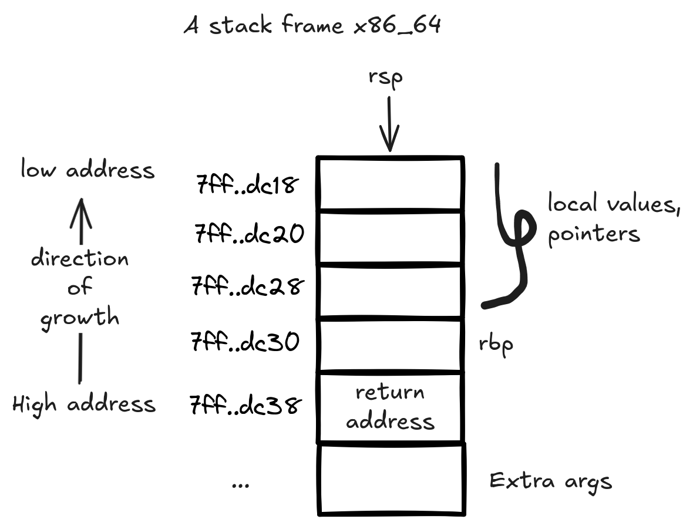
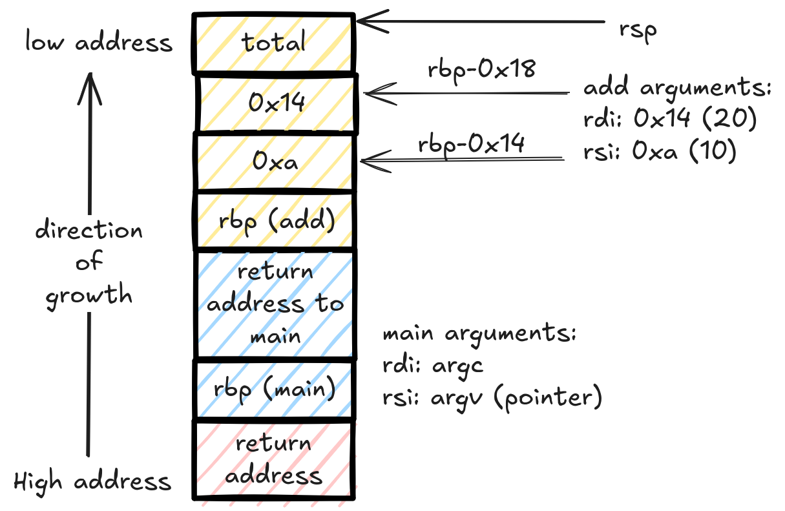
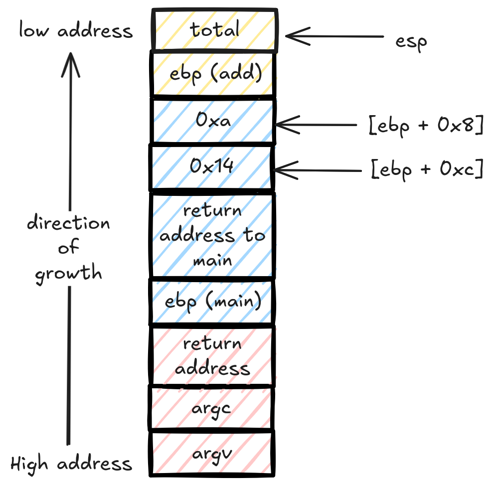

<!--more-->

Welcome home. In this series, we will go on a tour in the realm of binary exploitation. We will start with the basics and some
essential concepts for this to be a success for everyone. If you are already familiar with what you see in the table of contents,
jump to the next post (*hopefully I wrote it already :D*).

## The plan

We will explain what is necessary only for now. We will dive deeper when we need to later.
Take it easy and don't worry too much if some things are not clear yet. It will all make sense eventually.
I highly recommend trying and following along if you can. I will try to provide some code snippets and examples to help you out.

## The memory layout

So, when we run a binary, a couple of things happen behind the scenes.
This binary has a format when it is on disk. All we need to know for now that it is structured in some type of way.
When we run the said binary, the operating system takes this structure from the disk and loads it into memory.
When it loads it into memory, it organizes it in a different structure. This structure is the same for all binaries within the same operating system.
In this section, we will look at the memory layout of a binary when it is already loaded into memory.

Memory here by the way, is main memory. Also known as RAM. This is the memory that is used to run programs.



[Layout straight out of Wikipedia](https://en.wikipedia.org/wiki/Data_segment)

So this layout, is the same for every binary. Every binary has its own isolated memory layout. Every binary thinks its
the only thing running on the operating system. This is called *process isolation*.

>[!NOTE]
> A process here means a program that is now living in memory.

- Binary -> A file that describes a program. This file is on disk and is not running.
- Process -> A program that is now loaded into memory and is running or about to run.

There is of course a little more to it but we don't need to worry about none of that for now.

Let's go through this image step by step from the bottom to the top.

- text segment: also known as the code segment. This is where the *code* of the binary is stored.
It is *usually* a read-only part of memory. The CPU uses this part to know what to do to get this binary going.
- data segment: This is where your *initialized* global variables, static variables, constants and such. Initialized here means it starts with a value.
An example:

```C
static int a = 5;
```

- BSS segment: Same as above but the variables here are the ones that are *not initialized* by the programmer. They don't start with a value *theortically*. In reality, they all get initialized to zero by the OS when the binary is loaded into memory.

```C
static int a;
```

- heap segment: This place is used for *dynamic memory allocation*. In other words, this is where memory space gets reserved for variables that are created at runtime (read during execution). In C, this is done with functions like `malloc`, `calloc`, `realloc` and the memory gets released with `free`.

>[!NOTE]
> The heap grows upwards. This means that when we allocate memory, it will grow towards the higher addresses in memory. You don't need to worry too much about this right now.

```C
int *a = malloc(sizeof(int) * 10);
// This piece above will store 10 integers in the heap. It will give us a pointer to the first one.
// We will come around to pointers when we need to.
```

- stack segment: The main dish for our topic. This segment store all kinds of things. It is used for function local variables, function arguments, return addresses and such.
It represent a *state* of the running process. It helps the CPU keep track of what is going on right now and where things are. In other words, it helps the CPU keep track of the execution *context*.

```C
void hello(int arg1, int arg2){
  int a = 5;
  // etc ...
  return;
}
// arg1, arg2, a and a couple of other values are kept in the stack in something
// called a *stack frame*. More on that in the next section.
```

## The stack

Let's zoom in onto this stack segment we just mentioned. This is going to be the stage of many of our attacks.
There is a concept called the *stack frame*. It is a small region of the stack
where the variables and other values of a function are stored together. It is used by the
CPU in order to keep track of function calls, return addresses, local variables and such.
Each function has its own stack frame. This frame is created when the function is called and
"destroyed" when the function returns. It doesn't delete the frame or its values, it just ignores its existence.

### The stack fame

We will talk about the 64bit version of the stack. This is the most common nowadays.



As you can see, the stack frame generally grows "downwards" in memory, meaning new values are added at lower addresses.
There are two values that define the boundary of a stack frame; the stack base pointer (`RBP`) and the stack pointer (`RSP`).
The stack pointer (`rsp`) points to the top of the stack, it is used to push and pop values from the stack.
The base pointer (`rbp`) points to the bottom of the stack frame, it is used as a reference point for the stack frame.
In other words, the base pointer is an address the CPU uses to know where the stack frame starts and uses it with offsets to access the values in the stack frame. These values (`rsp, rbp`) are stored in registers, which are small memory locations that can hold typically one unit of memory for the given architecture. The nerds refer to this unit as a **word**. In our example, they can hold up to 64bits (8 bytes), this is sometimes called dword or double word because in legacy arch, 32bits is called a word instead. These registers are located quite close to the CPU. There are other registers that we will discuss once we get to the exploitin' part.

### How does this frame get the values?

Good question, in the x86_64 architecture, the first 6 arguments of a function are passed through the registers `rdi, rsi, rdx, rcx, r8, and r9`. This means that before a function calls another function,  it will put the arguments it wants to pass in these registers in the correct order. The called function will then set up its stack frame and retrieve these arguments from the registers. If there are more than 6 arguments, the calling function will push the additional arguments directly into the stack before calling the function.

As part of the called function [prologue](https://en.wikipedia.org/wiki/Function_prologue_and_epilogue), it will fetch the values from the registers and store them in its stack frame between the `rbp` and the `rsp` pointers.

When it comes to the pointers (the addresses) on the stack frame, the calling function will put its address which will be used to return to it. It will place it just above the `rbp` as you see above in the image. The `rbp` of this stack frame itself is pointing to the previous stack frame's `rbp` value which gets pushed into the stack during the current function prologue.

>[!NOTE]
> Functions return values are returned to the caller by putting them in the `rax / eax` registers. The caller then takes them out when the execution returns to it.

This is about enough initial info to start causing havoc moving on. If you're interested in the topic, check this post for more details on how x86_64 stack works: [x86_64 stack frame](https://eli.thegreenplace.net/2011/09/06/stack-frame-layout-on-x86-64).

### Differences with 32bit stacks

It is important to be aware of the 32bit architecture too since you will encounter it in the jungle every now and then.
There are some key differences between 64bit and 32bit.

- Arguments are passed only through the stack, there are no registers used for this.
- Registers are smaller, they can hold 32bits (4 bytes) and are prefixed with e for example `eax`, `ebx`, `ecx`, etc.

## Example

```c
int add(int num_arg1, int num_arg2){
    int total;
    total = num_arg1+num_arg2;
    return total;
}

int main(int argc, char** argv){
    int total = add(10, 20);
}
```

### 64bit version

Use this to compile in 64bit mode:

```bash
gcc sample.c -o sample -fno-stack-protector -z execstack -no-pie -std=c99 -g
```

This will produce this assembly code:

`main`

```assembly
   0x0000000000401120 <+0>:     push   rbp
   0x0000000000401121 <+1>:     mov    rbp,rsp
   0x0000000000401124 <+4>:     sub    rsp,0x20
   0x0000000000401128 <+8>:     mov    DWORD PTR [rbp-0x14],edi
   0x000000000040112b <+11>:    mov    QWORD PTR [rbp-0x20],rsi
   0x000000000040112f <+15>:    mov    esi,0x14
   0x0000000000401134 <+20>:    mov    edi,0xa
   0x0000000000401139 <+25>:    call   0x401106 <add>
   0x000000000040113e <+30>:    mov    DWORD PTR [rbp-0x4],eax
   0x0000000000401141 <+33>:    mov    eax,0x0
   0x0000000000401146 <+38>:    leave
   0x0000000000401147 <+39>:    ret
```

`add`

```assembly
   0x0000000000401106 <+0>:     push   rbp
   0x0000000000401107 <+1>:     mov    rbp,rsp
   0x000000000040110a <+4>:     mov    DWORD PTR [rbp-0x14],edi
   0x000000000040110d <+7>:     mov    DWORD PTR [rbp-0x18],esi
   0x0000000000401110 <+10>:    mov    edx,DWORD PTR [rbp-0x14]
   0x0000000000401113 <+13>:    mov    eax,DWORD PTR [rbp-0x18]
   0x0000000000401116 <+16>:    add    eax,edx
   0x0000000000401118 <+18>:    mov    DWORD PTR [rbp-0x4],eax
   0x000000000040111b <+21>:    mov    eax,DWORD PTR [rbp-0x4]
   0x000000000040111e <+24>:    pop    rbp
   0x000000000040111f <+25>:    ret
```

Here is the x86_64 stack frames for these two functions:



Yellow is `add` stack frame, blue is `main` stack frame and red is the runtime stack frame.

You can look up the assembly code with a disassembler like `objdump` or `gdb`. I used `gdb` with pwndbg.

>[!NOTE]
> The e-prefixed registers are part of the r-prefixed registers.
`EBP` $\subset$ `RBP`, `EAX` $\subset$ `RAX`, etc. The E registers are the lower 32 bits of the R registers.
When they are overwritten in a x64 machine, the higher bits are set to 0.

### 32bit version

use this to compile in 32bit mode:

```bash
gcc vuln.c -o vuln -fno-stack-protector -z execstack -no-pie -m32 -std=c99
```

This will produce this assembly code:

`main`

```assembly
   0x08049166 <+0>:     push   ebp
   0x08049167 <+1>:     mov    ebp,esp
   0x08049169 <+3>:     sub    esp,0x10
   0x0804916c <+6>:     call   0x804918c <__x86.get_pc_thunk.ax>
   0x08049171 <+11>:    add    eax,0x2e83
   0x08049176 <+16>:    push   0x14
   0x08049178 <+18>:    push   0xa
   0x0804917a <+20>:    call   0x8049146 <add>
   0x0804917f <+25>:    add    esp,0x8
   0x08049182 <+28>:    mov    DWORD PTR [ebp-0x4],eax
   0x08049185 <+31>:    mov    eax,0x0
   0x0804918a <+36>:    leave
   0x0804918b <+37>:    ret

```

`add`

```assembly
   0x08049146 <+0>:     push   ebp
   0x08049147 <+1>:     mov    ebp,esp
   0x08049149 <+3>:     sub    esp,0x10
   0x0804914c <+6>:     call   0x804918c <__x86.get_pc_thunk.ax>
   0x08049151 <+11>:    add    eax,0x2ea3
   0x08049156 <+16>:    mov    edx,DWORD PTR [ebp+0x8]
   0x08049159 <+19>:    mov    eax,DWORD PTR [ebp+0xc]
   0x0804915c <+22>:    add    eax,edx
   0x0804915e <+24>:    mov    DWORD PTR [ebp-0x4],eax
   0x08049161 <+27>:    mov    eax,DWORD PTR [ebp-0x4]
   0x08049164 <+30>:    leave
   0x08049165 <+31>:    ret

```

And here is the x86_32 stack frame for these same two functions:



Yellow is `add` stack frame, blue is `main` stack frame and red is the runtime stack frame.
>[!NOTE]
> The 32bit version fetches the arguments directly to registers and starts working with them.
It didn't copy the values down the stack like the 64bit version did.

## That's *call* folks

This should be enough to get us started smashing the stack. We will go through many scenarios so these things will become familiar very quickly. It will be beneficial to have some basic understanding of assembly and `C` but you can definitely learn as you go.
