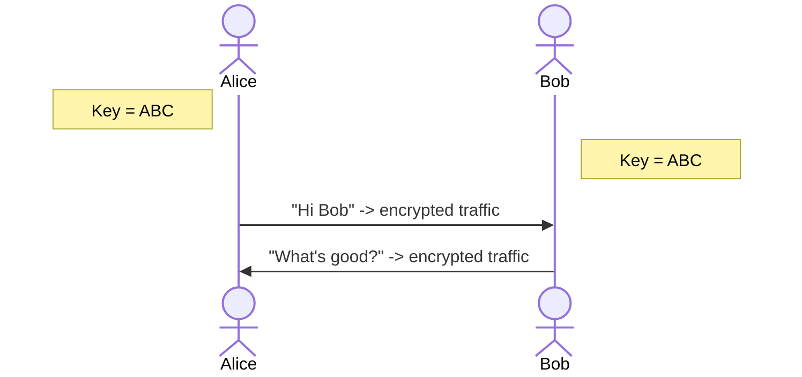
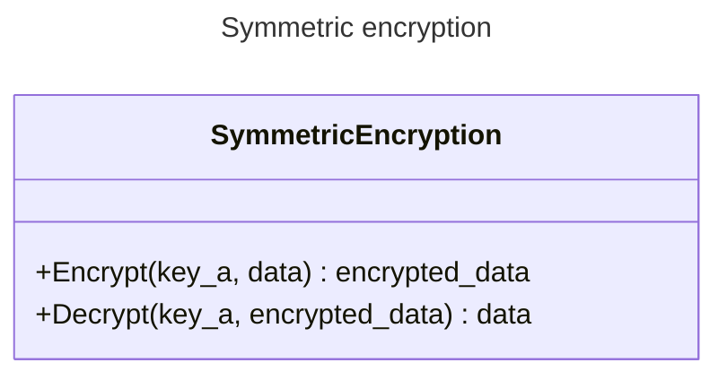
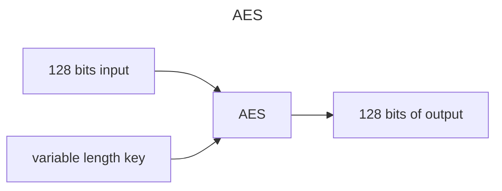
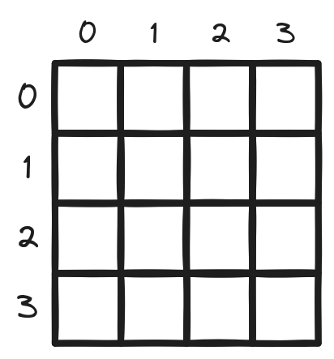
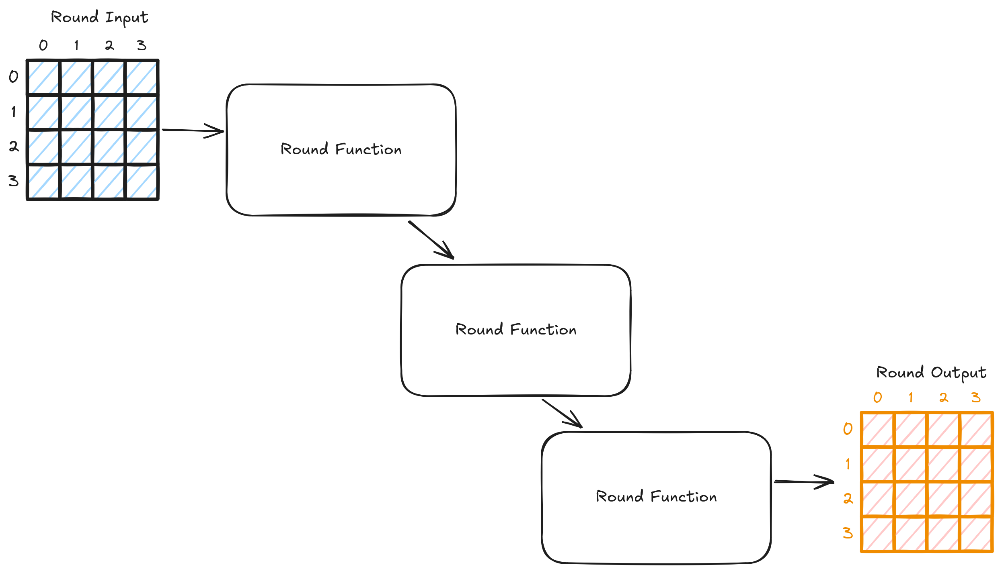
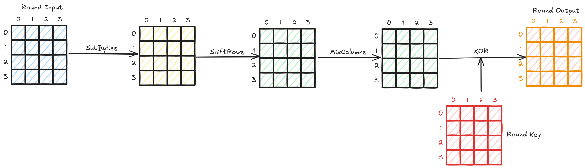
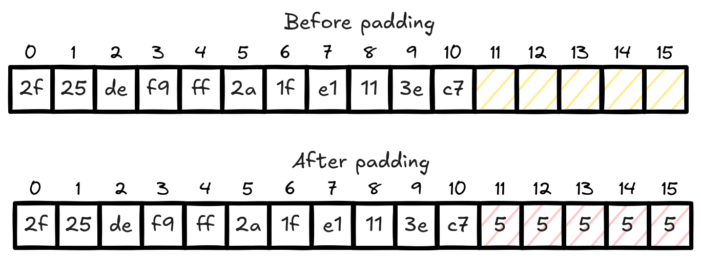
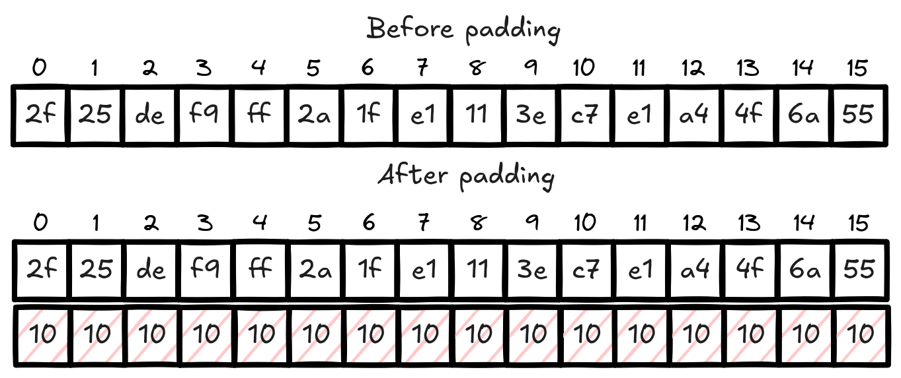

<!--more-->

This is a start of a new series where we go through a symmetric encryption algorithm called AES and related concepts.
We will start with explaining some theory on the cryptosystem of AES.
We will then move on to more advanced explanations and attacks.

## Symmetric encryption

The too long didn't read of [symmetric encryption](https://en.wikipedia.org/wiki/Symmetric-key_algorithm) is that both the sender and
the receiver share the exact same key to hide their communication.

The sequence diagram above is how AES is used in practice on a high level.

Both Alice and Bob have the same key, and it is used to pass around encrypted data.
This is a big limitation that is addressed by an asymmetric primitive called key exchange. We will
not delve too much into the details of how this limitation is addressed right now, if you are
in a hurry to find out, look up Diffie-Hellman key exchange algorithms (DH, ECDH, and the post-quantum alternatives).
Instead, we will focus on AES itself in isolation and highlight how it can be attacked.

You can think of symmetric encryption as a class of algorithms. This class has two functions. Encrypt and Decrypt.

AES is essentially an instance or an implementation of this class. There exist other implementations of this class too.

## AES

AES stands for Advanced Encryption Standard. It is an algorithm that won a NIST standardization process that ended some time in 2001.
Since then, there has been no known *practical* attacks against AES. You might be wondering what are we yapping about then?
Well, The algorithm itself does not have any known attacks, but some AES *cryptosystems* do.
We will define what exactly is a cryptosystem in a minute. Let's first define AES itself.

AES is an algorithm that requires two inputs and gives out one output.
Inputs:

- A key of size 128, 192, or 256 bits. This has to be unpredictable, uniformly random and secret.
- Your input, also known as plaintext. It has to be exactly 128 bits long or AES will not guarantee security.
Outputs:
- The encrypted data, also known as a ciphertext. It is exactly 128 bits long and it is supposed to be
indistinguishable from random gibberish data.

If you give AES what it wants, it can guarantee you an upper bound of 128 bits of security for the 128 bit key.

> [!NOTE]
> 128 bits of security means that an attacker would need to try $2^{128}$ different possible keys
> for a brute force attack. There are optimized algorithms that reduce the bits of security,
> but it's still a huge number of possibilities to try so it does not affect the security of AES in practice.
> There are attacks on AES that utilizes a small number of *rounds*. We will discuss rounds in a minute.

> [!NOTE]
> To put it in perspective, $2^{128}$ is a number with 39 digits. It can be written in words as:
> 340 undecillion 282 decillion 366 nonillion 920 octillion 938 septillion 463 sextillion 463 quintillion 374 quadrillion 607 trillion 431 billion 768 million 211 thousand and 456

As you might imagine the limitation of 128 bits of input, which is 16 bytes, is a big problem.
Most data we would want to encrypt will be bigger than this value. To remedy this issue, AES is augmented with two concepts
in order to make it work with arbitrary length data.

1. Modes of operation
2. Padding

Modes of operation describes how AES should handle data longer than 128 bits. Each mode does it differently.
Padding is essentially a workaround to stuff some data such that AES always gets 128 bits of data.
We will dive into these two concepts in a minute as they play a big role in the attacks we will be discussing.

Now, an AES cryptosystem can be defined as AES + Mode of operation + padding.

In this post, we will introduce AES and the padding it uses in order to prepare for the next posts.

### Algorithm

Let's dig into AES to see how it looks like under the hood.

AES treats its 128 bits of input as a 4x4 table of bytes where each block in the table is a byte.

The key is seen in a similar way too.
This is why AES is called a *block cipher*. It takes in a block and transforms it into another block.

AES takes this input table through several rounds of transformations called *rounds*.

The round function works the same each time. AES passes the input through these rounds a defined number of times.
In each one of these rounds, AES transforms the input table by calling 4 different functions which are called:

- SubBytes
- ShiftRows
- MixColumns
- AddRoundKey (XOR)

The transformations they do on the table is exactly as the name suggests.

As you might have noticed, every operation that a round function does is reversible. All except the last one, the XOR or AddRoundKey.
The XOR operation is the exclusive OR if you're not familiar. It's a bitwise operation that takes two bits and returns 1 if they are different and 0 if they're the same.

$1 \oplus 1 = 0$

$1 \oplus 0 = 1$

$0 \oplus 1 = 1$

$0 \oplus 0 = 0$

This operation is the basis of AES security. It is the reason why the key needs to be uniformly random and unpredictable.
This is because the input "inherits" the key's randomness through the XOR operation and hence looks random itself.
If the key is predictable and non-random such as a bunch of 128 bits of 0s, it will not hide the input data at all.

$input \oplus 0 = input$

This is because 0 is the identity element of the XOR operation.

The round key is a key that is derived from the original input key. AES creates a new key for each round using a type of algorithms called key schedule.

Now if the input is larger than 128 bits, the strategy to encrypt it with AES is to split it down to several blocks of 16 bytes such as above.
This means that the input length needs to be a multiple of 16 in order to have full blocks.
This length limitation is not great, so to solve this issue, we simply *pad* inputs that end up with the last block being less than 16 bytes.

## Padding

AES utilizes a padding scheme called PKCS#7 (Public Key Cryptography Standard number 7). This padding scheme is very simple.
If the last block of input after splitting is less than 16 bytes, then add the missing bytes such that we have 16 bytes.
We add the number of missing bytes repeated until we reach 16 bytes.
For example, if we have the block below, it's missing 5 bytes. Then we will add the value 5, five times.

After padding, the block is encrypted normally. Once it gets to its destination, the receiver
will decrypt and then remove this padding. It will do it by reading the value at the last block, in this case 5,
and then they will remove the last 5 bytes.

There is an edge case where the last block is already 16 bytes long. Using this unpadding algorithm, it may destroy the data by
mistakenly removing the data when reading the last block. To overcome this, PKCS#7 adds a whole new block of padding.
This way, there's always padding to remove. It's stupid simple but it works.

## Up next

We introduced both AES and the padding scheme it uses. Next, we will start looking into the modes of operation that makes
AES a cryptosystem. We will also look into what type of problems they create and how to exploit them.

Stay tuned for the next post in the series where we explain the Electronic Code Book (ECB) mode and how messed up it is.

